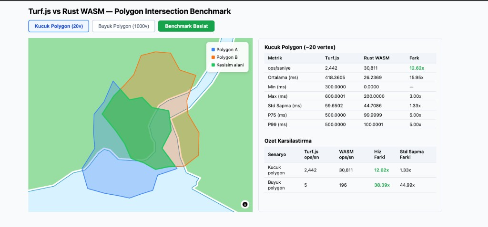
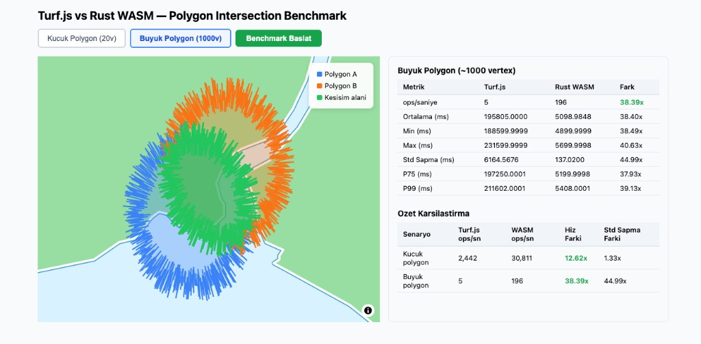

# Turf.js vs Rust WASM — Polygon Intersection Benchmark

This project benchmarks polygon intersection performance between Turf.js and Rust-based WebAssembly (WASM) under **real-world web application conditions**. The focus is not raw algorithm speed, but the **end-to-end** time each library takes inside a web app — from data preparation to receiving the result.

---

## Results

### Small Polygon (~20 vertices)



| Metric       | Turf.js | Rust WASM | Diff   |
|--------------|---------|-----------|--------|
| ops/sec      | 2,442   | 30,811    | 12.62x |
| Mean (ms)    | 418.36  | 26.24     | 15.95x |
| Min (ms)     | 300.00  | 0.00      | —      |
| Max (ms)     | 600.00  | 200.00    | 3.00x  |
| Std Dev (ms) | 59.65   | 44.71     | 1.33x  |
| P75 (ms)     | 500.00  | 100.00    | 5.00x  |
| P99 (ms)     | 500.00  | 100.00    | 5.00x  |

**Result:** For small polygons, Rust WASM is ~12.6x faster than Turf.js.

---

### Large Polygon (~1000 vertices)



| Metric       | Turf.js       | Rust WASM  | Diff   |
|--------------|---------------|------------|--------|
| ops/sec      | 5             | 196        | 38.39x |
| Mean (ms)    | 195,805.00    | 5,098.98   | 38.40x |
| Min (ms)     | 188,600.00    | 4,900.00   | 38.49x |
| Max (ms)     | 231,600.00    | 5,700.00   | 40.63x |
| Std Dev (ms) | 6,164.57      | 137.02     | 44.99x |
| P75 (ms)     | 197,250.00    | 5,200.00   | 37.93x |
| P99 (ms)     | 211,602.00    | 5,408.00   | 39.13x |

**Result:** For large, complex polygons, Rust WASM is ~38.4x faster than Turf.js.

---

## Summary

| Scenario      | Turf.js ops/sec | WASM ops/sec | Speed Diff  | Std Dev Diff |
|---------------|-----------------|--------------|-------------|--------------|
| Small polygon | 2,442           | 30,811       | **12.62x**  | 1.33x        |
| Large polygon | 5               | 196          | **38.39x**  | 44.99x       |

As polygon complexity increases, WASM's advantage grows dramatically. WASM also produces significantly more consistent results on the large polygon test (std dev is 44.99x lower).

---

## Metric Definitions

| Metric        | Description |
|---------------|-------------|
| **ops/sec**   | Number of intersection operations completed per second. Higher is better. |
| **Mean (ms)** | Average time for a single intersection operation. Lower is better. |
| **Min (ms)**  | Fastest recorded iteration. Represents the theoretical best-case performance. |
| **Max (ms)**  | Slowest recorded iteration. Reveals worst-case behavior (GC pauses, cache misses, etc.). |
| **Std Dev (ms)** | Measures how much latency varies between iterations. Lower = more consistent and predictable. |
| **P75 (ms)**  | 75% of iterations completed faster than this value. Represents typical performance. |
| **P99 (ms)**  | 99% of iterations completed faster than this value. Covers nearly all worst-case scenarios (tail latency). |

---

## Project Structure

```
turf-vs-wasm/
└── intersection-benchmark/
    ├── src/
    │   ├── App.jsx            # UI and benchmark orchestration
    │   ├── benchmark.js       # Measurement logic with TinyBench
    │   └── MapView.jsx        # MapLibre map view
    ├── scripts/
    │   └── generate-data.js   # GeoJSON test data generator
    ├── public/
    │   ├── small-a.geojson    # ~20 vertex polygon
    │   ├── small-b.geojson
    │   ├── large-a.geojson    # ~1000 vertex polygon
    │   └── large-b.geojson
    └── geo-wasm/
        ├── src/lib.rs         # Rust WASM intersection implementation
        └── pkg/               # Compiled WASM binary and JS bindings
```

---

## Benchmark Methodology

- **Tool**: [TinyBench](https://github.com/tinylibs/tinybench)
- **Iterations**: 500 for the small scenario, 100 for the large scenario
- **Warmup**: TinyBench default warmup (16 iterations, 250ms)
- **Data**: Seeded random polygons around Istanbul center (seeds 42 and 99 — fully reproducible)
- **Algorithm**: Martinez-Rueda family on both sides (Turf: polyclip-ts, WASM: geo crate BooleanOps)

### What Is Being Measured?

This benchmark measures a **real-world usage** scenario:

- **Turf.js side**: Intersection computed on pre-parsed JavaScript objects
- **WASM side**: Receive JSON string → parse JSON → convert GeoJSON to geo types → compute intersection → serialize result back to JSON string

WASM therefore carries the full serialization/deserialization cost of crossing the JS/WASM boundary. This is a realistic reflection of how you would actually use WASM in a web application. **Raw algorithm speed is not being measured.**

---

## Fairness Note

The benchmark is broadly fair but has a few asymmetries worth noting:

| Condition | Effect |
|-----------|--------|
| WASM parses JSON and converts GeoJSON types on every iteration; Turf uses pre-parsed JS objects | **Disadvantages WASM** |
| WASM serializes the result to a JSON string; Turf returns a JS object directly | **Disadvantages WASM** |
| Turf creates a new `featureCollection([a,b])` object on every iteration | **Disadvantages Turf** (minimal) |
| Turf always runs first (JIT still warming up); WASM runs second (CPU cache warmer) | **Unclear** |
| Turf allocates JS objects each iteration, which can trigger GC; WASM uses linear memory | **Disadvantages Turf** (unclear magnitude) |

**Overall:** WASM produces these results while bearing the serialization/deserialization overhead. If raw intersection performance were measured in isolation, the gap would be even larger.

---

## Development

```bash
cd intersection-benchmark
npm install
npm run dev
```

To regenerate test data:

```bash
npm run generate
```

To recompile WASM (requires `wasm-pack`):

```bash
cd geo-wasm
wasm-pack build --target web --release
```
